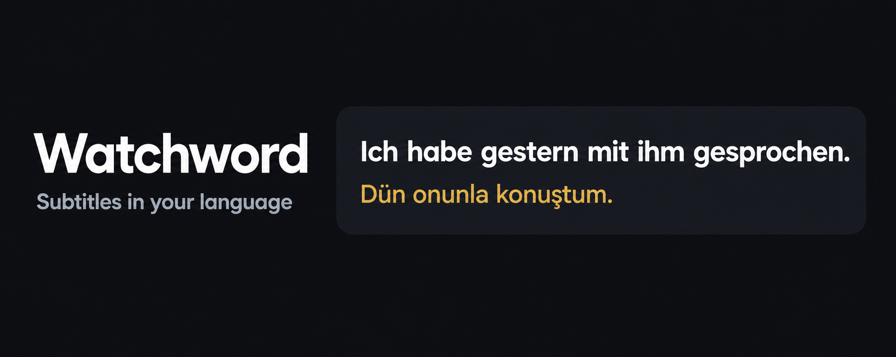
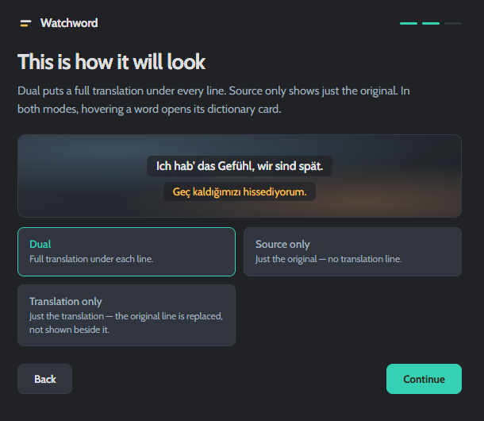
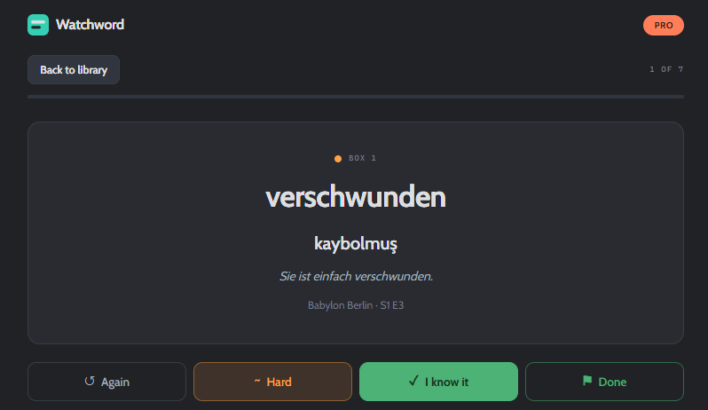
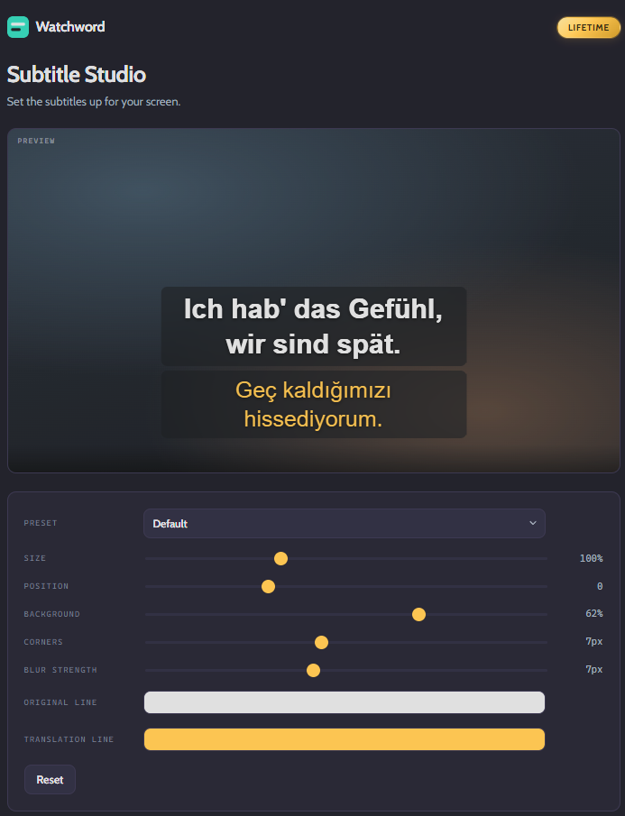
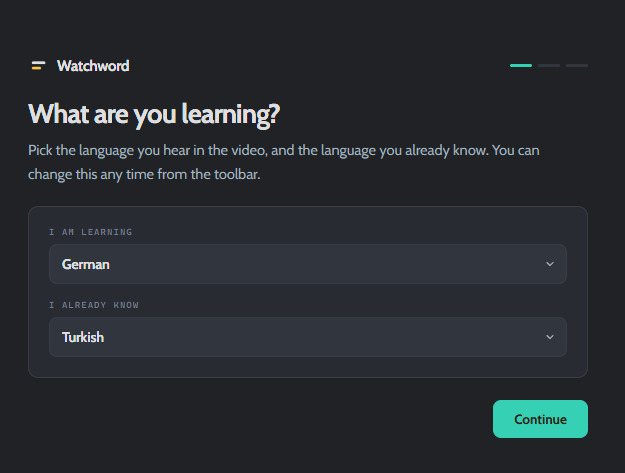
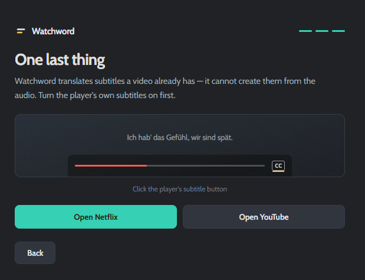

# Watchword

### Some shows never get subtitles in your language.

**Watchword translates the ones that are there** — one line, in your language,
right on the Netflix or YouTube player.

Manifest V3 · Chrome · No account · No analytics · No server

---

## The problem

If you live outside your own language, the catalogue does not serve you. A Turk
in Germany opens Netflix and finds German subtitles, sometimes English, rarely
Turkish. A Pole in the UK, an Arab in France, a Romanian in Spain — same
evening, same wall.

Netflix does not translate subtitles. It offers the tracks a title happens to
ship with, and if yours is not among them, that is the end of the conversation.

Watchword picks up where the platform stops.

---

## Three ways to watch

| | What you see | For |
|---|---|---|
| **Translation only** | One line, in your language | Watching something whose subtitles never come in your language |
| **Dual** | The original with a translation underneath | Following along while still reading the original |
| **Source only** | Just the original, hover any word | Studying — test yourself, look up only what you're stuck on |

The same extension, one setting apart. That is why it works for an evening of
television *and* for learning the language you are hearing.

The picker previews itself. Whatever you choose is drawn the way it will be
drawn on the video, so the choice is made by looking rather than by guessing.

---

## Why it reads better

Machine-translated subtitles usually read badly, and the reason is not the
engine — it is what the engine gets asked.

**A subtitle cue is a display unit, not a sentence.** "Ich habe gestern" and
"mit ihm gesprochen." arrive as two separate cues. Translate each on its own and
you get two halves of a thought. Watchword holds a cue that does not end a
sentence and sends it together with the next one.

The difference, measured across eight sentences split the way a cue would split
them — **all eight came out different**:

| Translated cue by cue | Translated as one sentence |
|---|---|
| "dün yaptım onunla konuştu." | **"Dün onunla konuştum."** |
| "Bana söyledi gelemeyeceğini." | **"Bana gelemeyeceğini söyledi."** |
| "Ayakta duran kadın kapının yanında annem var." | **"Kapının yanında duran kadın benim annemdir."** |
| "Bilmiyorum, bunun iyi bir fikir olup olmadığı." | **"Bunun iyi bir fikir olup olmadığını bilmiyorum."** |

The left column is what you get elsewhere. The first row is not grammatical
Turkish at all.

It costs nothing: each cue still triggers exactly one request. The later ones
simply carry more.

---

## What else it does

**Look up a word without leaving the video.** Hover or tap any word for its
translation, dictionary entries, an example sentence, and pronunciation.

**Keep the words worth keeping.** Save a word together with the line it appeared
in and a link back to the scene. The library sorts itself into *new*,
*learning* and *known*, and doubles as a spaced-repetition session — three
boxes, one key per answer, and a way to retire a word once you are done with it.

The four answers are told apart by weight and by glyph, not by colour alone:
ghost, then tinted, then solid. A distinction that disappears in greyscale is
not a distinction.

**Practise, not just watch.** Replay the current line with one key. Blur the
translation until you have tried without it. Pause automatically on every new
line. Slow the dialogue to 0.75× until you can hear the words.

**Read it comfortably.** A subtitle editor with live preview: size, position,
background, corner radius, blur and both text colours. When subtitles are how
you follow the show, being able to read them is not decoration.

The preview is not a mockup of the overlay. It loads the same stylesheet the
video does, so what the sliders show and what the film shows cannot drift
apart.

**Thirteen languages, any pair.** German, English, Turkish, Spanish, French,
Italian, Portuguese, Dutch, Russian, Japanese, Korean, Chinese, Arabic. The
interface itself speaks English, Turkish and German.

---

## Setting it up

Two questions and one reminder. Pick the language you are hearing and the one
you already know, choose how the lines should be drawn, and turn the player's
own subtitles on.

That last screen exists because of the one thing Watchword cannot do:
**it translates the subtitles a video already has, it does not transcribe the
audio.** If a title ships no subtitle track at all there is nothing to work
with, and saying so up front is cheaper than a confused first evening.

---

## Privacy is the product, not a policy page

Most tools in this space are cloud services wearing an extension's clothes: an
account, a quota, your text on someone's server.

Watchword has **no accounts, no analytics, and no servers of its own.** There is
nothing to sign up for. Your saved words, your review schedule and your settings
never leave your machine — there is nowhere for them to go.

The honest limit, stated plainly: subtitle lines and the words you hover are
sent to Google's public translate service to be translated, and cached on your
own device afterwards. That is the one thing that leaves, and it is the feature
you asked for.

---

## Pricing

Free is a real product, not a trailer: all three modes, word lookup, all
thirteen languages, spaced-repetition review, and up to 50 saved words.

| | Free | Pro | Lifetime |
|---|:---:|:---:|:---:|
| Subtitles, lookup, 13 languages | ✓ | ✓ | ✓ |
| Spaced-repetition review | ✓ | ✓ | ✓ |
| Saved words | 50 | unlimited | unlimited |
| Export to Anki & CSV | — | ✓ | ✓ |
| Playback speed | — | ✓ | ✓ |
| Subtitle editor · library backup | — | — | ✓ |

**€2.50/month** with a 7-day trial, or **€24.99 once.** No renewal, no account —
a licence key you paste in. Billing is handled by Polar as Merchant of Record.

---

## How it is built

A Manifest V3 extension with no backend, which turned a product promise into the
central engineering constraint: translation caching, licence validation, the
review scheduler and the word library all run in the browser, inside a service
worker Chrome stops whenever it likes.

- **A guest on someone else's page.** Netflix and YouTube re-render their
  players without warning, so the overlay verifies its parent rather than its
  presence and re-attaches itself — the difference between the two was the
  oldest bug in the product.
- **Per-site adapters.** Eight methods describe a platform; the rest of the code
  never knows which site it is on.
- **A build that refuses.** The release checklist is not a document, it is a
  gate: the package will not be produced while a development flag is on or the
  payment configuration points at a sandbox. The file list is derived from the
  manifest, because a hand-kept one goes stale silently.
- **Measured, not assumed.** The comparison above ships as a runnable script. A
  planned context-window feature was deleted before it was written when the same
  method showed it changed nothing in twelve cases.
- **5,856 lines shipped, 9 test suites, 313 assertions, zero dependencies.**
  The tests run on a clean checkout with nothing installed.

---

## Status

In development, with a Chrome Web Store release in preparation. Netflix and
YouTube today; more platforms once the store round is behind it.

**The source is not public.** Watchword is a commercial product, so the
repository here is the story rather than the code.

Questions about the product or the work behind it are welcome as an issue on
this repository, or through [github.com/ertanm](https://github.com/ertanm).

© 2026 Watchword. All rights reserved.

